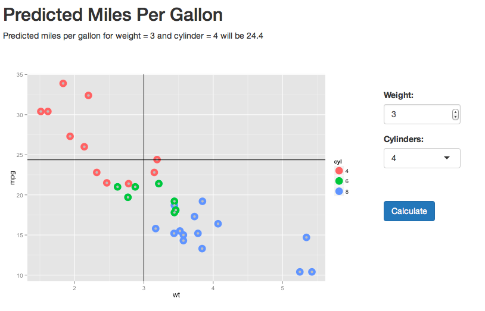

## Introduction

1. To deploy an iterative application onto web using the R package Shiny.
2. Dataset to be used will be mtcars.
3. Algorithm used is multivariate linear regression.

Steps to do
-----------
1. User will select the parameters and click calculate button. 
2. The tool will predict the miles per gallons based on the number of cylinders and weight using the multivariate linear regression algorithm.
3. The result will be plotted on the graph and the value will be displayed.

---

## Algorithm

Using the multivariate linear regression algorithm, mtcars datasets and the inputs of the parameters (cylinder and weight), the miles per gallons will be predicted.

For example:
------------
If you choose 4 cylinders and a weight of 3 tons, the prediction will be:


```r
data(mtcars)
mtcars$cyl <- as.factor(mtcars$cyl)
 
round(predict(lm(mpg ~ cyl + wt, data=mtcars), 
              newdata=data.frame(cyl=factor("4"), wt=c(3))), , digits=2)
```

```
##  1 
## 24
```

---

## What will be displayed

This will be displayed for a prediction of a 4 cylinders and 3 tons car.



---

## To access the application

Click  <a href="https://ctsk.shinyapps.io/develop_data_prod/">here</a> to access the application.

---
